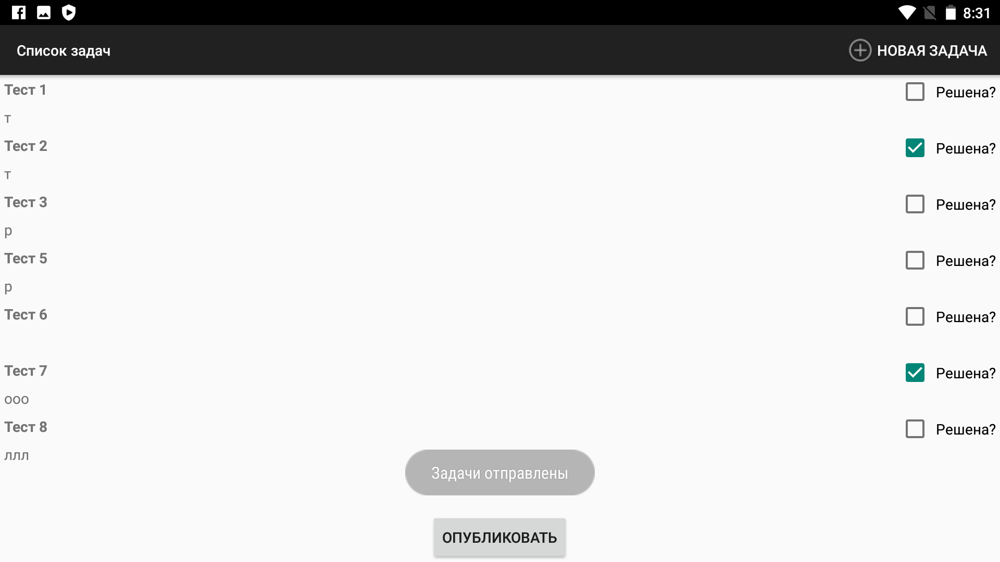

## Список задач

Это приложение предназначено для совместного хранения списка задач.

Оно состоит из двух активностей: список и детализация. Задачи хранятся в SQLite базе данных.

Все задачи, созданные в этом приложении можно опубликовать на сервере <https://buran-it-sch.herokuapp.com/>

Исходники сервера лежат [здесь](https://github.com/aoklyunin/AndroidTasksServer)

Перед первой отправкой Вам необходимо указать свой логин, чтобы отправить задачи на сервер.

Этот логин будет сохранён в SharedPreferences, и больше указывать его будет не нужно.

APK приложения можно скачать [здесь](report/taskList.apk), 
презентацию  [здесь](report/СПб_239_Клюнин.pptx), а видео - [тут](report/video.mp4)