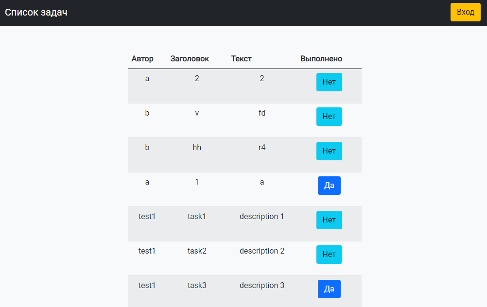

## Список задач

Это приложение предназначено для совместного хранения списка задач.

Все задачи, созданные в этом приложении лежат на сервере <https://buran-it-sch.herokuapp.com/>

Перед первой отправкой Вам необходимо указать свой логин, чтобы отправить задачи на сервер.

Этот логин будет сохранён в SharedPreferences, и больше указывать его будет не нужно.

APK приложения можно скачать [здесь](report/taskList.apk), 
презентацию  [здесь](report/СПб_239_Клюнин.pptx)